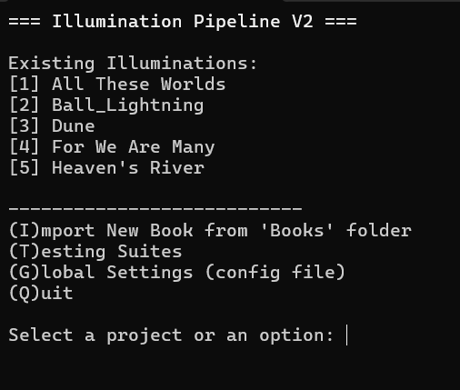
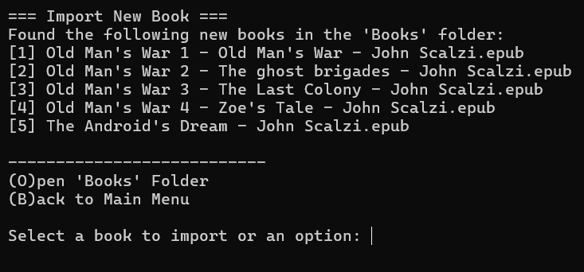
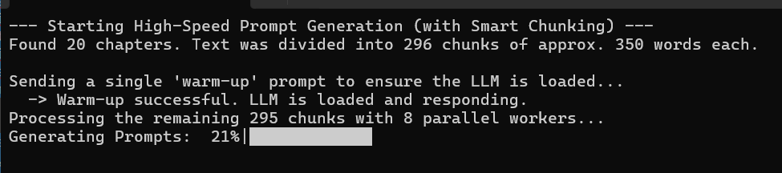
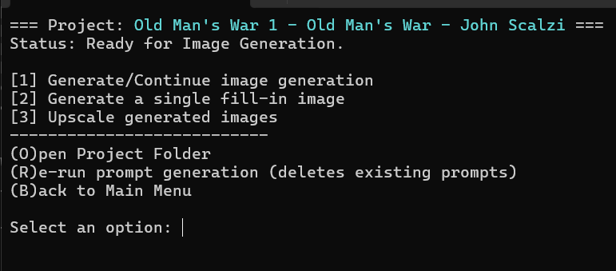
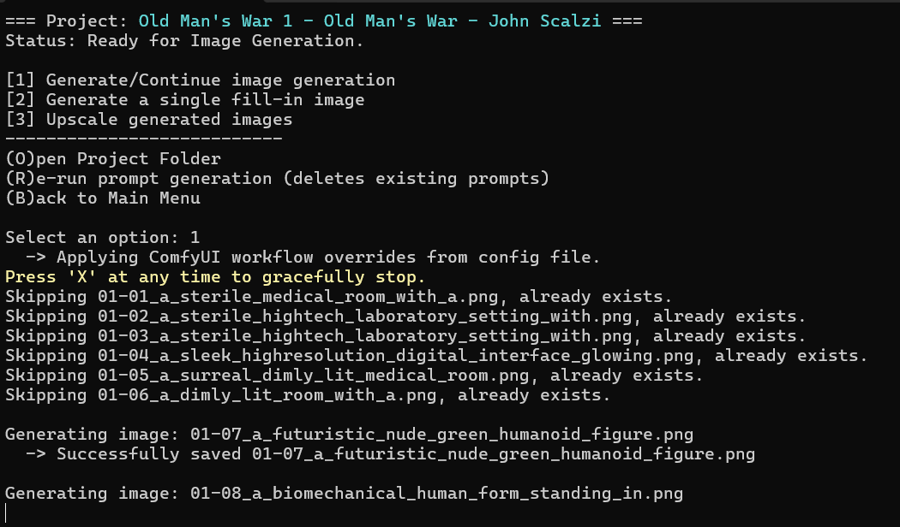
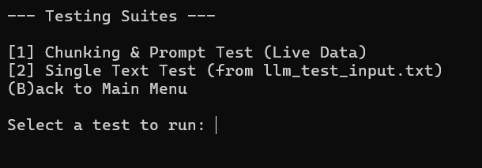

# Illumination Pipeline

> A command-line tool to automate the conversion of e-books into a series of beautifully illustrated images using local AI.

## About The Project

The Illumination Pipeline was created to bridge the gap between literature and AI art. Manually creating prompts for every scene in a book is a tedious and time-consuming process. This tool automates the entire workflow, from parsing an EPUB file to generating a final, upscaled image for key moments in the story.

It intelligently chunks the book's text, uses a local Large Language Model (LLM) to generate descriptive visual prompts, and then pipes those prompts into a local image generation backend (like SD Forge or ComfyUI) to create the illustrations.

## Key Features

- **EPUB to Text:** Automatically extracts clean, readable text from `.epub` files.
- **AI Prompt Generation:** Connects to any OpenAI-compatible local LLM server (e.g., LM Studio) to generate context-aware image prompts.
- **Smart Chunking:** Intelligently groups paragraphs into larger, configurable chunks to control the number and density of illustrations.
- **Dual Backend Support:** Works out-of-the-box with both **SD Forge (Automatic1111)** and **ComfyUI**.
- **Batch Image Generation:** Processes the entire list of prompts to generate hundreds of images in a single run.
- **Batch Upscaling:** A separate, resumable post-process to upscale all your generated images.
- **Config-Driven Workflows:** All settings, from LLM temperature to ComfyUI model names, are controlled via simple JSON configuration files. No code changes needed.
- **Interactive CLI:** A user-friendly, menu-driven interface that guides you through every step of the process.

## Getting Started

Follow these steps to get the Illumination Pipeline up and running on your local machine.

### Prerequisites

You must have the following software installed and running:

1.  **Python 3.9+:** [Download Python](https://www.python.org/downloads/)
    - *Recommended:* Use a virtual environment manager like **Conda** to keep dependencies clean.
2.  **A Local LLM Server:** This tool is designed for local AI. The recommended server is [LM Studio](https://lmstudio.ai/), which provides an OpenAI-compatible API endpoint.
3.  **A Local Image Generator:** You need one of the following running with its API enabled:
    - **[SD Forge](https://github.com/lllyasviel/stable-diffusion-webui-forge):** Must be running with the `--api` command-line argument.
    - **[ComfyUI](https://github.com/comfyanonymous/ComfyUI):** The API is enabled by default. The standalone version is recommended for ease of use.

### Installation

1.  **Clone the Repository:**
    ```bash
    git clone https://github.com/your_username/illumination-pipeline.git
    cd illumination-pipeline
    ```

2.  **Create and Activate a Virtual Environment (Recommended):**
    ```bash
    conda create -n illumination python=3.11 -y
    conda activate illumination
    ```

3.  **Install Dependencies:**
    ```bash
    pip install -r requirements.txt
    ```

4.  **CRITICAL: Configure the Pipeline:**
    - Find the file named `global_config.json.template` in the root directory.
    - **Make a copy** of this file and rename it to `global_config.json`.
    - **Open `global_config.json`** and edit the settings to match your local setup. You **must** update the following:
        - `llm_settings.model_name`: The name of the model you have loaded in LM Studio.
        - `default_project_settings.common_settings.image_generator_type`: Choose `"comfyui"` or `"forge"`.
        - If using ComfyUI, you **must** set `comfyui_settings.comfyui_path` to the full path of your ComfyUI installation.
        - Update model names (`ckpt_name`, `lora_name`, etc.) in the appropriate settings block (`forge_settings` or `comfyui_settings`).

## Usage

The pipeline is designed to be run from your terminal.

1.  **Add Your Book:** Place your `.epub` file inside the `Books` folder.
2.  **Run the Script:**
    ```bash
    python main.py
    ```
3.  **Import the Book:** From the main menu, select `(I)mport New Book` and choose your file. The script will create a new project in the `Illuminations` folder.
4.  **Clean the Text:** The extracted text file (`_clean.txt`) will automatically open. **This is a crucial step.** Remove any table of contents, forewords, title pages, or other non-story text. Save and close the file.
5.  **Generate Prompts:** Press Enter in the terminal to go to the project menu. Select `[1] Generate prompts from book text`. The script will use your LLM to create a `_prompts.csv` file.
6.  **Generate Images:** Once prompts are ready, select `[1] Generate/Continue image generation`.
7.  **(Optional) Upscale Images:** After generation is complete, select `[3] Upscale generated images`.
8.  **(Optional) Clean Up:** If you used ComfyUI, you can safely remove the duplicate images from its output folder by selecting `(C)lean up ComfyUI Output Folder`.

## Configuration

All settings can be changed without editing the Python code.

-   **`global_config.json`**: This file contains the main settings for the application and the default settings for all new projects. Use the "comment keys" (`"__comment__": "..."`) for guidance.
-   **`prompt_template.txt`**: This file contains the master prompt sent to the LLM. You can edit it to fine-tune the style and content of the generated image prompts.
-   **`[Your Project]/config.json`**: Each project has its own config file, copied from the defaults in `global_config.json`. You can edit this file to use a different art style, model, or backend for a specific book without affecting your global defaults.

## Advanced Usage: Custom ComfyUI Workflows

This pipeline is designed for flexibility. Advanced ComfyUI users can use their own complex workflows.

1.  Build your workflow in ComfyUI.
2.  In your main positive prompt node (e.g., `CLIPTextEncode`), put the placeholder `<prompt>`. Do the same for your negative prompt with `<negprompt>`.
3.  Use the **"Save (API Format)"** button and save the workflow `.json` file into the `Comfy_Workflows` folder.
4.  In your project's `config.json`, change `comfyui_settings.generation_workflow` to point to your new file.
5.  Set `comfyui_settings.workflow_overrides.enabled` to `false`.

The script will now load your custom workflow and only inject the prompts, leaving all of your other carefully tuned settings untouched.

---

### A Visual Walk-through

Here is a step-by-step visual guide to the core workflow of the Illumination Pipeline.

#### Step 1: The Main Menu
When you first launch the application, you'll be greeted by the main menu. It lists any existing projects found in your `Illuminations` folder and provides the main options to get started.



#### Step 2: Importing a New Book
Select `(I)mport New Book` to see a list of available `.epub` files from your `Books` folder. After selecting a book, the pipeline extracts the text and automatically opens the `_clean.txt` file for your review. This is a crucial step to remove any non-story text like title pages or tables of contents.



#### Step 3: Generating Prompts
Once you've cleaned the text and entered the new project's menu, you can generate the image prompts. The application connects to your local LLM, processes the entire book using the chunking settings from your config, and shows a progress bar as it works.



#### Step 4: The Project Menu
After prompts have been generated, the project menu updates to show new options for image generation and upscaling. You can also open the project folder directly or clean up the ComfyUI output folder if you're using the ComfyUI backend.



#### Step 5: Generating Images
Select `Generate/Continue image generation` to start creating your illustrations. The pipeline will work through your `_prompts.csv` file, sending each prompt to your configured image generation backend. If the process is interrupted, you can run it again, and it will automatically skip the images that have already been created.



**From Batch Generation**
An example of an image generated during a full book run, based on the style defined in the configuration.
>A sterile, high-tech laboratory setting with glowing blue holographic interfaces, a sleek PDA floating mid-air, and a series of interconnected neural wires pulsing with faint bioluminescent energy.


### Additional Features

#### Fill-in Images
Need to add an image for a scene that was missed or want to try a different take? The `Generate a single fill-in image` option lets you quickly create a new illustration for any chapter without re-running the whole batch.


**From a Fill-in Prompt**
An example from the 'fill-in' feature, allowing for more specific, user-directed scenes.
> A group of people inside of a spaceship looking at planets


#### Fine-Tuning with the Test Suite
Before a long run, you can use the Testing Suites to fine-tune your results. The Chunking Test lets you see how your live book data is chunked and what prompts are generated, allowing you to perfect your `prompt_template.txt`.




## Models used:

[Juggernaut XL](https://civitai.com/models/133005)

[Hyperdetailed Colored Pencil](https://civitai.com/models/1155749)